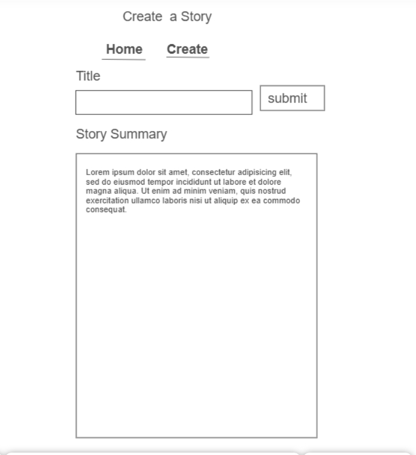
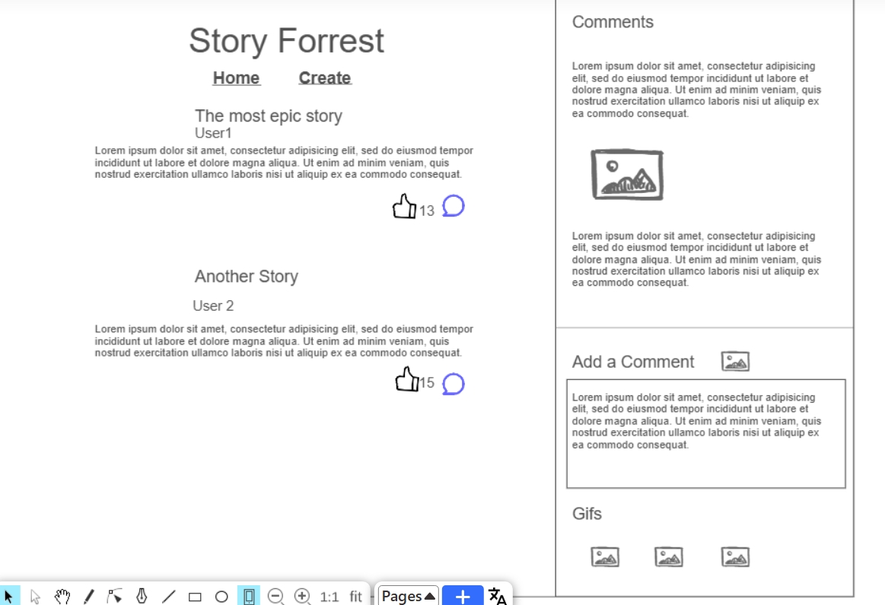
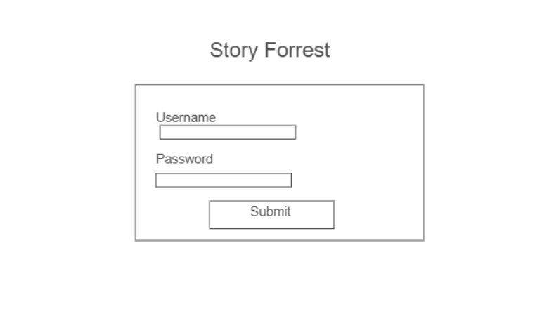

# Your startup name here

[My Notes](notes.md)

This is my notes file. 

<!-- > [!NOTE]
>  This is a template for your startup application. You must modify this `README.md` file for each phase of your development. You only need to fill in the section for each deliverable when that deliverable is submitted in Canvas. Without completing the section for a deliverable, the TA will not know what to look for when grading your submission. Feel free to add additional information to each deliverable description, but make sure you at least have the list of rubric items and a description of what you did for each item.

> [!NOTE]
>  If you are not familiar with Markdown then you should review the [documentation](https://docs.github.com/en/get-started/writing-on-github/getting-started-with-writing-and-formatting-on-github/basic-writing-and-formatting-syntax) before continuing. -->

## This was edited in the web
this is the text that I added form the editor in git.

## 🚀 Specification Deliverable

> [!NOTE]
>  Fill in this sections as the submission artifact for this deliverable. You can refer to this [example](https://github.com/webprogramming260/startup-example/blob/main/README.md) for inspiration.

For this deliverable I did the following. I checked the box `[x]` and added a description for things I completed.

- [x] Proper use of Markdown - proper text usage and embedded images in markdown
- [x] A concise and compelling elevator pitch
- [x] Description of key features
- [x] Description of how you will use each technology
- [ ] One or more rough sketches of your application. Images must be embedded in this file using Markdown image references.

### Elevator pitch

Are you someone who loves writing stories, but feel like you don't have anyeone to share your passion with? Well, now that's been solved. Story Forrest is a website that will let writers share their hobby with others who share this intrest. Here, you can post a short summary of a story you want to write, and you and others can comment on and "like" each other's ideas, providing additional ideas and positive feedback. Now you can enjoy the thrill of explaining your story ideas to others and hearing their own more than ever!

### Design
### Main Page

### Create Story Page

### Login Page

### Key features

- Each user has their own account.
- A user can upload a summary of a story they want to write
- These stories become available for others to see in a feed style. 
- comment button under each post selects the post to be commented on.
- Sidebar which allows users to comment on a post as well as view comments on that post. 
- Gifs can be added to the comment section in place of a comment.
- like button for each story

### Technologies

I am going to use the required technologies in the following ways.

- **HTML** - Design of three pages, login, feed/comments, and creating a post. This will create the structure of the site. Also, navigation allowed between "feed/comments page" and "creating a post" page. Creates a "like" button icon. Also, holds text and titles. 
- **CSS** - Make the page look good through coloration and text sizing.
- **React** - Submit comments/gifs and stories and allows the "like" button to be used.
- **Service** - Allowing users to login.
              - gets gifs from an external api
              - retreive storis and comments and like counts from database.
              - adding stories and comments and like counts to database.
- **DB/Login** - Stores users and passwords. Database stores stories, comments and likes, and which go to what story
- **WebSocket** - instant updates of the "like" button.

## 🚀 AWS deliverable

For this deliverable I did the following. I checked the box `[x]` and added a description for things I completed.

- [x] **Server deployed and accessible with custom domain name** - [My server link](https://wyvernforrest.click).

## 🚀 HTML deliverable

For this deliverable I did the following. I checked the box `[x]` and added a description for things I completed.

Changes - Added images the Images file and all three html pages to html layouts.

- [x] **HTML pages** - Created a login, index (storeis and comments), and a writeStory page.
- [x] **Proper HTML element usage** - Used header, nav, div, body and section. Included html and head tag. All pages implement html elemnts to create the page. footer was used, but is currently empty in all pages.
- [x] **Links** - navigation links in header, login button navigates to homepage. Also a github link
- [x] **Text** - Text is used for labeling across the website
- [x] **3rd party API placeholder** - comment shows where this goes in the index page
- [x] **Images** - small images are included next the website title in the index page and login page. One is also included next to some top text in the writeStory page.
- [x] **Login placeholder** - this is created with html. there is a username and password field along with a submit button. This serves as a placeholder as it has not been fully implemented yet, but it does navigate to the index page.
- [x] **DB data placeholder** - lorem ipsum is used to show where stories and comments would be. these come from the database. The number of likes is displayed next to the like button. Gif's id will be stored in the database and then refetched in the website. A Gif is shown.
- [x] **WebSocket placeholder** - This is the like button and there is a comment identifying it as the websocket element.

## 🚀 CSS deliverable

For this deliverable I did the following. I checked the box `[x]` and added a description for things I completed.

I have 4 css files, one for each page and a headerFooter file that is used in every page.

- [x] **Header, footer, and main content body** - Header with title and navigation. footer with github repo link. Universal across all three pages.
    - index.html - login area
    - home.html - scrollable main area for storys. Sidebar with three section for comments. Top is to read other people's comments, below that is navigation for going between writing a comment or posting a gif. below is the writing comment section. below that and extremely tiny is the gif area. All that is there is a post button and some text. The comment sidebar is super squished because I will have navigation to change what the comment sidebar displays. NOTE: because not all elements in the comment section are complete, like the switchable display and the gif 3rd party call are not yet present, some css for those elements was left unfinished as the css would be easier to do after those elemnts are made. 
    - writeStory.html a single, positioned scrollable area to write a story in. 
- [x] **Navigation elements** - colored and styled buttons for comment navigation. colored buttons for page navigation. 
- [x] **Responsive to window resizing** - minor functionality. There are only two @media sections for this part. One gets rid of the header and footer under a certain height and the other gets rid of the comment section. They are in headerFooter.css and home.css respectively. also added the meta tag to make the starting width the device width. no other elements were specifically designed to be resized. 
- [x] **Application elements** - There is a lot of css in this program, but the bulk of the elements are text and div elements due to the nature of this website. There are colored s with opacity to see thorugh them in login and the large window in home. All elements in the pages are organized. the gif in comment section is appropriately sized. text areas in the comment section and write story page are appropriately sized. padding on various elements and using "gap:" helps with asthetic. flex columns are everywhere. rows are used for comment and like buttons, as well as possibly other places. 
- [x] **Application text content** - all text font changed to trebuchet MS. Some manual font resizing as well in random elements. labels are appropriately positioned.
- [x] **Application images** - background image is a forrest. a parchement image is used for the comment and writestory areas. There is also a small picture next to the site title in the header and a quill picture near a header in writeStory.css. 

## 🚀 React part 1: Routing deliverable

For this deliverable I did the following. I checked the box `[x]` and added a description for things I completed.

- [x] **Bundled using Vite** - did this
- [x] **Components** - 3 differnet components in feed, login, and writestory folders. They are wraped in functions that can be called. 
- [x] **Router** - Navlinks change sections of the app.jsx file to load 3 different urls

## 🚀 React part 2: Reactivity deliverable

For this deliverable I did the following. I checked the box `[x]` and added a description for things I completed.

Some information regarding the use of the website. 
 - To login, enter any username and password, hit register, then hit login. The navigation should appear. 
 - There are two other pages feed and writestory. You will need to create a story in writestory before you can do anything in the feed
 - Once a story is created, it will appear in the feed. Select the comment icon to select the comments for that story. 
 - In the comments pannel in the feed section, select post comment. then select either type comment or GIF to post a comment. 
 - This comment should now be visible when clicking view comments.
 - All data is stored in localstorage.

- [x] **All functionality implemented or mocked out** - all features are implemented or mocked out except for the web hook.
- [x] **Hooks** - React.useState is used to select what to display in the side comments section. Specifically it allows for navigation between the different comment options. It also is used to highlight the selected gif in blue when posting a gif comment. Finally, it is used to restirct the navigation menu to be shown only when a user has succesfully logged in. I didn't have a great use for React.useEffect. I have a console messages for when a user is changed, and another console message showing the list of loaded stories in the feed tab. 

## 🚀 Service deliverable

For this deliverable I did the following. I checked the box `[x]` and added a description for things I completed.

- [x] **Node.js/Express HTTP service** - implemented.
- [x] **Static middleware for frontend** - implemented as "app.use(express.static('public'))" in service.jsx
- [x] **Calls to third party endpoints** - call to retrieve 5 gifs based on inputed search terms from tenor in postGifcomponent.jsx
- [x] **Backend service endpoints** - registerUser, loginuser, logout user, post story, retrieve story, get story keys, update the likes of a story, add a comment to a story.
- [x] **Frontend calls service endpoints**
    * login.jsx supports the register, login, logout endpoints.
    * feed.jsx calls an endpoint which gets all the storykeys, then uses that data to retrieve every story through the endpoint which retrieves a story. 
    * postgifcomponent.jsx has teh 3rd party api which retrieves gifs, and uses an endpoint that adds a comment to a story. 
    * storyblock.jsx uses the endpoint which edits the comment count.
    * viewCommentsComponent.jsx uses the endpoint that retrieves a story in order to display its associated comments.
    * writeCommentComponent.jsx also uses the endpoint that adds a comment to a story. 
    * writeStory.jsx uses the endpoint that adds a story.

- [x] **Supports registration, login, logout, and restricted endpoint** - endpoint for the first three, the restricted endpoint is the 401 unauthorized error thrown by the verifyAuth middleware. All endpoints are called from login.jsx

## 🚀 DB deliverable

For this deliverable I did the following. I checked the box `[x]` and added a description for things I completed.

- [x] **Stores data in MongoDB** - story data for stories includeing title, content, comments and likes. I have methods for retrieving the a story, adding comments to a story, adding likes to a story, adding a story to the database, and retrieving all the keys (these are the automatically generated _ids). (stories collection).
- [x] **Stores credentials in MongoDB** - methods for adding, retrieving and updating users to properly login, logout and register a user. Auth token is created when a user logs in or is registered. (users collection). getUser is also used for authentication purposes to compare user.token to the browser authtoken. 

## 🚀 WebSocket deliverable

For this deliverable I did the following. I checked the box `[x]` and added a description for things I completed.

- [ ] **Backend listens for WebSocket connection** - I did not complete this part of the deliverable.
- [ ] **Frontend makes WebSocket connection** - I did not complete this part of the deliverable.
- [ ] **Data sent over WebSocket connection** - I did not complete this part of the deliverable.
- [ ] **WebSocket data displayed** - I did not complete this part of the deliverable.
- [ ] **Application is fully functional** - I did not complete this part of the deliverable.
